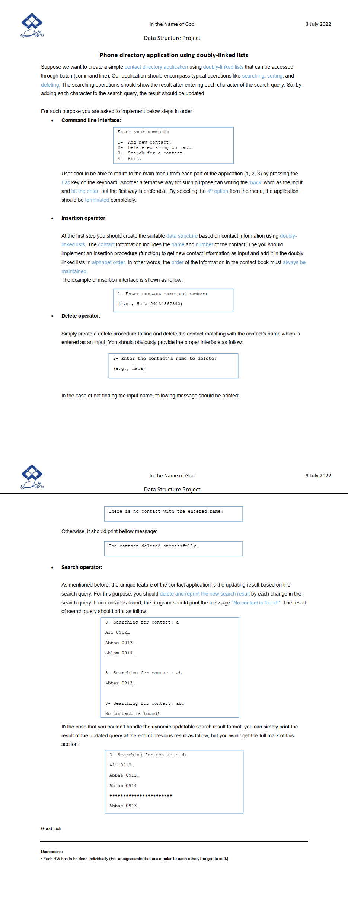
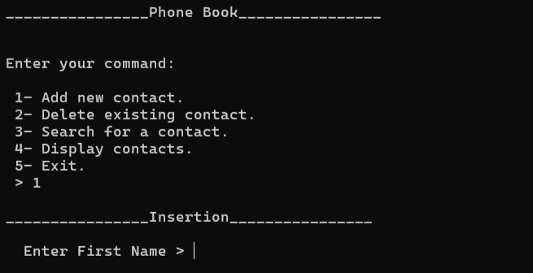
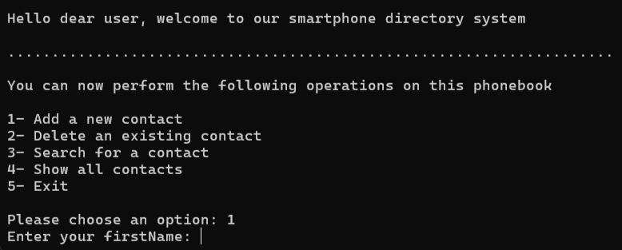

# **☎️ Phone Book Project | پروژه دفترچه تلفن**

**A university project in which a phone book is designed with Python language.**

**یک پروژه دانشگاهی که در آن یک دفترچه تلفن با زبان پایتون طراحی می‌شود.**

# 💬 **نکات پروژه**

* عکس‌های برنامه در دایرکتوری ScreenShots قرار دارند.
* برای اجرا برنامه، به پایتون بالاتر از نسخه 3.6 نیاز دارید.
* کتابخانه‌های مورد نیاز در فایل requirements.txt قرار دارند.
* پروژه اصلی Project Phone Book.py است. پروژه‌ی دیگر محتوای یکسان دارد ولی با روش‌ دیگری پیاده‌سازی شده‌است و ظاهر متفاوتی نیز دارد.
* برای دسترسی به همه‌ی پروژه‌های دانشگاهی من، به این لینک مراجعه کنید:

👈🏻 **[پروژه‌های دانشگاهی من](https://github.com/bestmahdi2/Uni__Bachelors_SKU_Path)**

# 📝 **توضیحات پروژه**

# 🖼 **عکس‌های پروژه**

  
  
  

